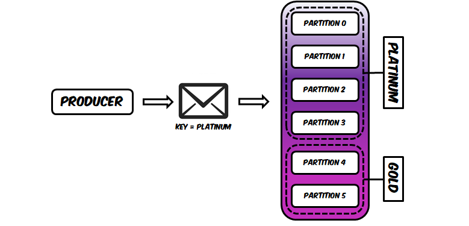

# Bucket Priority Partitioner

Implement record prioritization in [Apache Kafka](https://kafka.apache.org) is often a hard task because Kafka doesn't support broker-level reordering of records like some messaging technologies do.
Some developers see this as a limitation but the reality is that it isn't because Kafka is not supposed to allow record reordering in the first place.
In a distributed commit log records are immutable and so their ordering within the topic partitions.
Nevertheless, this doesn't change the fact the developers would like to implement record prioritization in Kafka.

This project contains a partitioner that solves this problem differently, by breaking down the Kafka topic into multiple buckets, and each bucket will have a configurable number of partitions assigned to it.
Developers can control how large/small each bucket will be by providing an allocation percentage in the configuration properties used to construct a Kafka producer.
In runtime the partitioner relies on data avaiable on each record key to decide which bucket to use, while being able to fallback to another strategy if the record doesn't contain the necessary data in the key or if there is no key whatsoever.



In the example above, a producer is sending a record with a key that contains the string `Platinum`.
The partitioner then will decide that the record should be sent to one of the partitions belonging to the bucket `Platinum`, therefore leveraging one of the partitions assigned to that bucket (`0`, `1`, `2`, or `3`) as shown above.
The partitioner distributes the records within each bucket using a round robin algorithm to maximize consumption parallelism.

The usage of this partitioner distributes records into buckets that might have different priorities to the business, and if the consumers also rely on the same logic they can coordinate themselves to process certain buckets before others to implement the record prioritization.
You can use the project [Bucket Priority Assignor](https://github.com/riferrei/bucket-priority-assignor) to ensure that your consumers will be assigned to the topic partitions using the bucket priority logic.

## Building the project

The first thing you need to do to start using this partitioner is building it. In order to do that, you need to install the following dependencies:

- [Java 11+](https://openjdk.java.net/)
- [Apache Maven](https://maven.apache.org/)

After installing these dependencies, execute the following command:

```bash
mvn clean package
```

Keep in mind that this command also force the tests to be executed. Some of the tests rely on the [TestContainers](https://www.testcontainers.org/) framework and therefore -- you will need to have a functional Docker installation in your machine.
If this is not the case or you just want the connector then execute the command with the parameter `-DskipTests`.

## Using the partitioner

Thanks to the pluggable architecture from Kafka, using a different partitioner in your producer is just a matter of registering it into the configuration.

```bash
Properties configs = new Properties();

configs.setProperty(ProducerConfig.PARTITIONER_CLASS_CONFIG,
   BucketPriorityPartitioner.class.getName());

KafkaProducer<K, V> producer = new KafkaProducer<>(configs);
```

In order to work properly, you need to specify in the configuration which topic will have its partitions grouped into buckets.
This is important because in Kafka the topic is specified in a record level, not in a producer level.
This means that the same producer can be used to write records into different topics, so the partitioner needs to know for which topic the bucket prioritization will be applied.


```bash
configs.setProperty(BucketPriorityPartitionerConfig.TOPIC_CONFIG, "orders");
```

Finally you have to specify in the configuration which buckets will be configured and what is the partition allocation for each one of them.
The partition allocation is specified in terms of percentage.
For this reason, the sum of the partition allocation need to be one hundred.


```bash
configs.setProperty(BucketPriorityPartitionerConfig.BUCKETS_CONFIG, "Platinum, Gold");
configs.setProperty(BucketPriorityPartitionerConfig.ALLOCATION_CONFIG, "70, 30");
```

## Fallback action

There are some situations where the partitioner will need to know what to do when there is not enough data available in the record to decide which bucket to use. For instance:

* When the topic specified in the record doesn't need record prioritization.
* When a key is not present in the record or it's not using the right format.
* When the data about which bucket to use don't exist or can't be found.

For these situations the partitioner needs to know what to do and we call this fallback action.
By default the fallback action is to leverage the same logic used for the default partitioner in Kafka.
But you can modify this behavior by specifying for example that it should use round robin:

```bash
configs.setProperty(BucketPriorityPartitionerConfig.FALLBACK_ACTION_CONFIG, "RoundRobin");
```

Alternatively, you can also specify that the fallback action is just discard the record:

```bash
configs.setProperty(BucketPriorityPartitionerConfig.FALLBACK_ACTION_CONFIG, "Discard");
```

# License

This project is licensed under the [Apache 2.0 License](./LICENSE).
